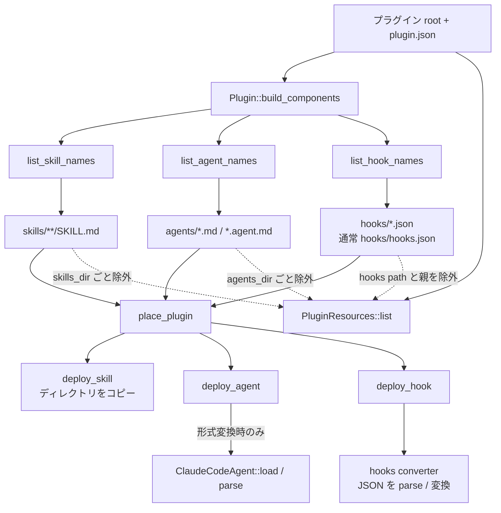

# Skill / Subagent frontmatter hooks 供給経路（独立機能 Issue 定義）

> **状態:** 実装前の仕様確定
>
> **親タスクではない関連 Issue:** [#462](https://github.com/DIO0550/plugin-manager/issues/462)
>
> **上流確認日:** 2026-08-28
>
> **公式仕様:** [Skills](https://code.claude.com/docs/en/skills) / [Subagents](https://code.claude.com/docs/en/sub-agents) / [Hooks reference](https://code.claude.com/docs/en/hooks)

## Issue 概要

Claude Code プラグインでは、独立した `hooks/hooks.json` に加え、Skill の
`SKILL.md` と Subagent の Markdown の YAML frontmatter も hook の供給元になる。
PLM は現在、この 2 経路を Hook コンポーネントとして読み込まない。本 Issue では
frontmatter hook の解析、コンポーネントにスコープした配置、診断、テストを追加する。

Issue #462 は **`hooks/hooks.json` 経路**のイベント、hook type、フィールドの上流追随だけを
扱う。本 Issue は #462 に依存せず実装でき、#462 の対応イベント数を完了条件に含めない。

## 現在の入力経路

### コンポーネントの検出から配置まで



現在の重要な境界は次のとおり。

- Skill の「parser」に相当する通常配置処理は `SKILL.md` を構造化モデルへ読み込まない。
  スキャンはファイルの存在だけを見て、配置時はディレクトリをコピーした後、ターゲット別の
  許可キーを行単位で残す。`plm pack` の軽量バリデーションだけが `name` と
  `description` を YAML として読む。
- Subagent はスキャン時には Markdown の内容を読まない。形式変換が必要な配置だけが
  `src/parser/claude_code/agent.rs` の `ClaudeCodeAgentFrontmatter` へ deserialize するが、
  現在のモデルは `name` / `description` / `tools` / `model` しか保持しない。
- `hooks/hooks.json` は独立した `ComponentKind::Hook` として検出され、Hook 配置入口から
  converter へ渡る。Skill / Subagent の配置入口からこの経路へ合流する処理はない。
- `src/plugin/resources.rs` は skills、agents、hooks をプラグイン直下の汎用 resource から
  それぞれ除外する。このため frontmatter hook が偶然 resource 配置経路で有効になることもない。

## 公式 frontmatter スキーマ

### 読み取りキー

両コンポーネントとも、YAML frontmatter の top-level **`hooks`** キーだけを読む。
`hook`、`lifecycle-hooks`、`metadata.hooks` などの別名は受理しない。

```yaml
---
name: guarded-component
description: Run with component-local checks
hooks:
  PreToolUse:
    - matcher: "Bash|Write"
      hooks:
        - type: command
          command: "$CLAUDE_PROJECT_DIR/scripts/check.sh"
  PostToolUse:
    - matcher: "Write"
      hooks:
        - type: command
          command: "$CLAUDE_PROJECT_DIR/scripts/audit.sh"
  Stop:
    - hooks:
        - type: command
          command: "$CLAUDE_PROJECT_DIR/scripts/finish.sh"
---
```

`hooks` の値は `hooks.json` のトップレベル `hooks` オブジェクトの**内側**と同じ
`event -> matcher group[] -> hook[]` 形であり、`{"hooks": ...}` というラッパーは書かない。
frontmatter で公式に認めるイベントは以下に限定する。

| 所属 | frontmatter キー | イベント | 有効期間 |
|------|------------------|----------|----------|
| Skill | `hooks` | `PreToolUse` / `PostToolUse` / `Stop` | 当該 Skill が呼び出されている間 |
| Subagent | `hooks` | `PreToolUse` / `PostToolUse` / `Stop` | 当該 Subagent の実行中 |

matcher group と hook 定義のフィールド、各 type の必須・任意フィールドは同じ確認日の
Claude Code Hooks reference を正とする。実装では `hooks.json` と frontmatter に別々の
緩い構造体を作らず、#462 が更新する共通のイベント・type・フィールドモデルへ decode する。
ただし、共通モデルが知るイベントでも上表にないイベントは frontmatter では未知イベントとして扱う。

## 配置と有効範囲の決定

frontmatter hook は、**所属コンポーネントを選択して配置したときだけ有効**にする。
プラグイン全体の Hook コンポーネントへ昇格・統合してはならない。

- Skill を配置しなければ、その `SKILL.md` の hook は配置しない。
- Subagent を配置しなければ、その Markdown の hook は配置しない。
- 配置先が同じコンポーネントスコープを表現できる場合は、frontmatter に保持または等価な
  component-local 設定へ変換する。
- 配置先が component-local hook を表現できない場合は、グローバルな `hooks.json` へ
  フォールバックしない。該当コンポーネントの配置は続行し、hook 定義ごとに
  `unsupported_component_scoped_hooks` 警告を返して hook だけを除外する。
- Skill の許可 frontmatter キーを絞るターゲットでは、`hooks` を無条件に strip する前に
  解析と上記診断を行う。Subagent の形式変換でも `hooks` を一度共通モデルへ取り出してから、
  配置先の能力に従って再出力または除外する。

この決定は、ある Skill / Subagent を導入しただけで無関係なセッションや別 Subagent に
hook の副作用が広がることを防ぎ、Claude Code の lifecycle scope を維持する。

## hooks.json との併用規則

同じプラグインに `hooks/hooks.json`、Skill frontmatter、Subagent frontmatter が共存しても、
それぞれを独立した供給元として保持する。対象コンポーネント実行時の論理的な評価順は次で固定する。

1. `hooks/hooks.json` の該当イベント（ファイル内の matcher group / hook 配列順）
2. 実行中 Skill の frontmatter `hooks`（Skill 内の記載順）
3. 実行中 Subagent の frontmatter `hooks`（Subagent 内の記載順）

Skill から Subagent を起動した場合に限り 3 系統すべてが候補になる。PLM が生成物を単一配列へ
物理統合するターゲットでも、この順を保つ。ターゲットの実行基盤が供給元間の順序を保証できない
場合は `hook_source_order_not_guaranteed` を配置 1 回につき 1 件出し、保証しているかのように
ドキュメント表示しない。

### 重複と競合

- 同じイベントであること自体は競合ではなく、上記順ですべて登録する。
- `type` と、その type の実行内容を表す全フィールド、matcher、timeout 等を正規化した値が
  同一でも**重複排除しない**。hook は副作用を持ち、同一記述でも実行回数が意図であり得る。
- 完全一致を複数供給元で検出した場合は実行を残し、後続定義ごとに
  `duplicate_hook_definition` 警告を出す。診断には先行・後続双方の供給元と位置を含める。
- `command` と `prompt` のように type が異なる定義、同じ matcher で異なる command、
  許可・拒否に異なる結果を返し得る定義も上書き競合とはみなさない。配列順で全件実行する。
- 単一ファイルしか置けないターゲットで物理統合時に表現を失う場合は、黙って last-write-wins
  にせず `unrepresentable_hook_conflict` エラーとしてそのコンポーネントの配置を失敗させる。

## 解析と診断

診断は最低限 `severity`、安定した `code`、`component_kind`、`component_name`、入力ファイルの
プラグイン root 相対パス、1 始まりの `line` / `column`、イベント名、hook 配列 index を持つ。
パスは絶対パスにせず、CLI の通常表示と structured output の両方へ同じ情報を渡す。

| 条件 | severity / code | 配置結果 |
|------|-----------------|----------|
| Markdown が UTF-8 でない、先頭 frontmatter の閉じ `---` がない | error / `invalid_markdown_frontmatter` | 所属コンポーネントを失敗 |
| YAML 構文エラー、`hooks` が mapping でない、matcher group / hook が配列でない | error / `invalid_frontmatter_hooks_yaml` | 所属コンポーネントを失敗 |
| `hooks` 内の未知イベント（frontmatter で許可されない既知イベントを含む） | warning / `unknown_frontmatter_hook_event` | そのイベントだけ除外、所属コンポーネントは配置 |
| hook の `type` 欠落または未知 type | warning / `unknown_frontmatter_hook_type` | その hook だけ除外、兄弟定義は維持 |
| 既知 type の必須フィールド欠落・型不一致 | error / `invalid_frontmatter_hook_definition` | 所属コンポーネントを失敗 |
| 配置先が component-local hook 非対応 | warning / `unsupported_component_scoped_hooks` | hook だけ除外、所属コンポーネントは配置 |

不完全な frontmatter を「frontmatter なし」として本文へ戻す挙動は採用しない。`hooks` が存在する
文書では厳密に失敗を返す。未知イベント・未知 type は将来の上流追加でコンポーネント全体を
利用不能にしないため要素単位の警告とするが、未知値を既知値へ推測するフォールバックは行わない。

## 実装範囲

- `src/parser/claude_code/agent.rs`: frontmatter の `hooks` を共通モデルで保持し、変換時にも
  診断と source location を失わない。
- Skill parser: 通常 install/import 経路で `SKILL.md` frontmatter を厳密に読み、本文と
  未変更フィールドを保持できる専用モデルを追加する。`plm pack` だけの軽量 parser に載せない。
- `src/plugin/resources.rs`: frontmatter hook に参照される Skill / Subagent 付属スクリプトが、
  所属コンポーネントのコピーに含まれることをテストする。汎用 plugin resources へ複製しない。
- hooks 読み込み入口: `hooks.json` と 2 種の frontmatter が同じ hook schema validator と
  診断型を使うようにする。供給元と component scope は型として保持する。
- install/import の結果表示: 警告を `ComponentKind::Hook` の成功結果だけに閉じず、Skill / Agent
  の成功・失敗にも関連付けて表示する。

## 統合テストの受け入れ条件

以下を一時プラグインから実際の install/import 配置入口まで通す。parser 単体テストだけでは
完了としない。

- [ ] `hooks/hooks.json`、hooks 付き Skill、hooks 付き Subagent が同居し、3 コンポーネントを
  選択すると、対応ターゲットで全供給元が失われず、論理順が hooks.json → Skill → Subagent になる。
- [ ] Skill だけ、Subagent だけ、両方を選ばない場合を検証し、未選択コンポーネントの hook が
  プラグイン全体の `hooks.json` へ混入しない。
- [ ] 同じイベント・完全一致定義を hooks.json と各 frontmatter に置き、定義を 3 回維持したまま
  後続 2 件へ `duplicate_hook_definition` が出る。
- [ ] 同じイベント・matcher で異なる type / command を併用し、上書きせず配列順を維持する。
- [ ] component-local hook 非対応ターゲットでは Skill / Subagent 本体は配置され、frontmatter hook
  はグローバル化されず `unsupported_component_scoped_hooks` が出る。
- [ ] Skill と Subagent の各々について、壊れた Markdown fence、壊れた YAML、`hooks` の型違い、
  既知 type の必須フィールド欠落が所属コンポーネントの失敗と位置付き error になる。
- [ ] 未知イベントと未知 hook type を同じ文書の有効定義と併用し、未知要素だけが除外され、
  有効定義と本体が配置され、各 warning に相対パス・行・列・配列 index が含まれる。
- [ ] frontmatter hook が相対参照する Skill / Subagent 配下のスクリプトを同梱し、配置後も
  所属ディレクトリ内の相対構造が保たれ、`PluginResources` 側へ重複コピーされない。
- [ ] 更新・再配置で hook が増殖せず、コンポーネント削除または選択解除後に component-local
  hook が残留しない。
- [ ] structured output と人向け出力で error / warning の code と供給元情報が一致する。

## 完了条件

- 上記スキーマ、スコープ、順序、診断を実装し、全受け入れ条件を自動テスト化する。
- 対応ターゲットと非対応ターゲットを `docs/reference/hooks-schema-mapping.md` に追記する。
- Issue #462 から frontmatter hook の調査・実装項目を除き、本 Issue へのリンクを残す。
- #462 で追加されるイベント・type・フィールドは共通モデルを通じて利用できる設計にするが、
  #462 の完了を本 Issue のブロッカーにはしない。
