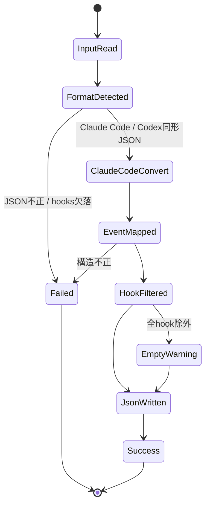
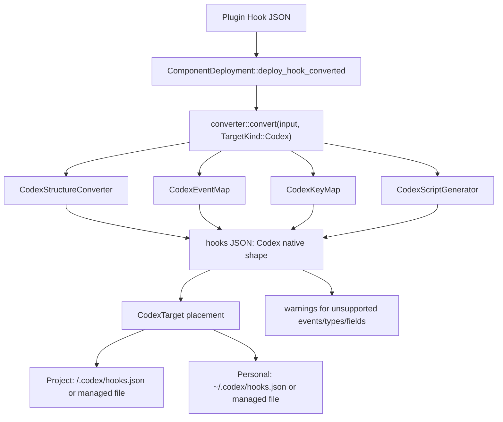

# Codex Hooks 変換 実装計画

作成日: 2026-05-06

## 目的

Claude Code 形式の Hook コンポーネントを Codex ターゲットへインストールできるようにする。

既存の Hooks 自動変換は主に Claude Code 形式から Copilot CLI 形式への変換を扱っている。一方、現在の OpenAI Codex 公式ドキュメントでは Codex Hooks が提供されており、`~/.codex/hooks.json`、`<repo>/.codex/hooks.json`、または plugin の `hooks/hooks.json` からライフサイクル設定を読み込める。Codex の JSON 形状は Claude Code と近いため、Codex 向けは Copilot 向けのような大きなスキーマ変換ではなく、対応イベントの検証、非対応 hook 種別の除外、配置パスの有効化を中心に実装する。

参照:
- OpenAI Codex Hooks: https://developers.openai.com/codex/hooks
- Codex plugin packaging: https://developers.openai.com/codex/plugins/build
- 既存仕様: [docs/hooks-conversion/index.md](./hooks-conversion/index.md)
- 既存実装メモ: [docs/architecture/hooks-conversion.md](./architecture/hooks-conversion.md)

## 現状

### 実装済み

- `src/hooks/converter/converter.rs` に、ターゲット別の `EventMap`、`ToolMap`、`KeyMap`、`StructureConverter`、`ScriptGenerator` を差し替える多層コンバータがある。
- `TargetKind::Copilot` は `create_layers()` で有効化済み。
- `src/hooks/converter/codex.rs`、`src/hooks/event/codex.rs`、`src/hooks/tool/codex.rs` は存在するが、実質 skeleton。
- `ComponentDeployment::deploy_hook_converted()` は `converter::convert(input, target_kind)` を呼べるため、ターゲット種別を渡す設計は既にある。

### 未実装・古い前提

- `src/target/env/codex.rs` は `ComponentKind::Hook` を非対応としている。
- `create_layers(TargetKind::Codex)` が未登録。
- `CodexEventMap` は全イベントを未対応扱いする。
- `CodexScriptGenerator` は空 script を返すため、そのまま有効化すると壊れた配置になる。
- 既存ドキュメントの一部は「Codex Hooks 非対応」前提が残っている。

## 設計方針

Feature ベースの既存構成に合わせ、Hooks 関連の変換は `src/hooks/`、ターゲット配置は `src/target/env/codex.rs`、デプロイ統合は `src/component/deployment/` に閉じる。

Codex 向け変換は以下の原則にする。

- Codex のネイティブ JSON 形状は PascalCase event + matcher group + `hooks[]` なので、Claude Code 形式を基本的に保持する。
- Codex が対応する event と field だけを通し、明確に非対応な hook 種別は警告付きで除外する。
- `command` hook は script wrapper を生成しない。元の `command` をそのまま使う。
- `http` / `prompt` / `agent` hook は Codex公式仕様上の command hook として直接実行できないため、初期実装では除外する。必要なら Phase 2 で command wrapper 化する。
- Codex Hooks は feature flag `codex_hooks = true` が必要なため、PLMが自動で `config.toml` を編集するかは別判断にする。初期実装では hook配置時に警告またはドキュメント更新で明示し、設定ファイル編集は追加Phaseへ分離する。

## システム図

### 状態マシン



### データフロー



## フォルダ構造

### 現在

```text
src/
├── hooks/
│   ├── converter.rs
│   ├── converter/
│   │   ├── converter.rs
│   │   ├── copilot.rs
│   │   └── codex.rs        # skeleton
│   ├── event/
│   │   └── codex.rs        # skeleton
│   └── tool/
│       └── codex.rs        # passthrough
├── component/deployment/
│   └── hook_deploy.rs
└── target/env/
    └── codex.rs            # Hook非対応
```

### 実装後

```text
src/
├── hooks/
│   ├── converter/
│   │   ├── converter.rs    # TargetKind::Codex を登録
│   │   ├── copilot.rs
│   │   └── codex.rs        # Codex変換の本体
│   ├── event/
│   │   └── codex.rs        # Codex対応イベントのマッピング
│   └── tool/
│       └── codex.rs        # matcher alias正規化を必要に応じて実装
├── component/deployment/
│   └── hook_deploy.rs      # scriptなし変換の扱いを確認
└── target/env/
    └── codex.rs            # Hook対応と配置パス追加
```

## 主要コンポーネント設計

### `CodexEventMap`

対応イベントを Codex ネイティブ名へ写像する。Claude Code と Codex はどちらも PascalCase なので、多くは同名で返す。

初期対応:

| 入力 | 出力 | 備考 |
|---|---|---|
| `SessionStart` | `SessionStart` | matcher は `source` に適用 |
| `PreToolUse` | `PreToolUse` | Bash / apply_patch / MCP |
| `PostToolUse` | `PostToolUse` | Bash / apply_patch / MCP |
| `UserPromptSubmit` | `UserPromptSubmit` | matcher は無視される |
| `Stop` | `Stop` | matcher は無視される |
| `PermissionRequest` | `PermissionRequest` | Codex固有イベント。入力にあれば保持 |

`SubagentStop` など Codex公式Hooksにないイベントは `UnsupportedEvent` にする。

### `CodexStructureConverter`

Codex形式の扱い:

- `CodexStructureConverter::detect_format` は Codex専用の passthrough 判定を持たず、`hooks` を持つJSONを `SourceFormat::ClaudeCode` として扱う。
- Claude Code形式とCodex形式はほぼ同形なので、同じ検証・フィルタリング経路を通す。
- PascalCase event key は `CodexEventMap` で対応イベントだけ保持し、非対応イベントは警告付きで除外する。
- `version` は Codex Hooks JSON では不要。Copilot向けの `version: 1` は追加しない。
- `disableAllHooks` は Codex仕様にないため `RemovedField` で除去する。

### `CodexKeyMap`

`command` hook では以下を保持する。

- `type`
- `command`
- `timeout`
- `statusMessage`

以下は初期実装では除去候補。

- `async`
- `once`
- Copilot専用の `bash` / `timeoutSec` / `comment`

### `CodexScriptGenerator`

Codexは command hook をそのまま実行できるため、command hook では script を生成しない設計にしたい。ただし既存の `convert_hook_definition()` は `ScriptGenerator` が必ず `ScriptInfo` を返し、`bash` フィールドを挿入する前提になっている。

実装では最小変更として、`CodexScriptGenerator` が空 path の `ScriptInfo` を返し、共通変換側が `script_info.path.is_empty()` を script 生成なしの inline hook として扱う。Copilot既存挙動は維持し、Codex command hook だけ元の `command` を保持する。

この方式は抽象としては暫定であり、将来的に `ScriptGenerator` の戻り値を `Inline(Value)` / `GeneratedScript(ScriptInfo)` のような enum に拡張すると、意図を型で表現できる。

### `CodexTarget`

`supported_components()` に `ComponentKind::Hook` を追加する。

配置先は公式探索パスに合わせる。

- Project: `<repo>/.codex/hooks.json`
- Personal: `~/.codex/hooks.json`

ただし現行PLMは複数Hookコンポーネントを個別ファイルとして置く構造を採る。Codexは複数hook sourceを読むが、公式の代表パスはレイヤーごとに `hooks.json` である。ここは設計判断が必要。

推奨は「Phase 1では単一ファイル配置」:

- `ComponentKind::Hook` の Codex 配置先を `.codex/hooks.json` にする。
- 複数Hookコンポーネントの同時インストールは上書きリスクがあるため、Phase 1では検知して警告、Phase 2でマージ機構を入れる。

代替案は「`.codex/hooks/<name>.json` に置く」だが、Codex公式探索パスとして明記されていないため採用しない。

## 実装フェーズ

### Phase 1: CodexネイティブHooksの最小対応

1. `CodexEventMap` を実装する。
2. `CodexKeyMap` で command hook の許可フィールドを整理する。
3. `CodexStructureConverter` で `version` 非追加、`disableAllHooks` 除去、PascalCase維持を実装する。
4. `create_layers(TargetKind::Codex)` を登録する。
5. `ScriptGenerator` 周辺で空 path を inline command として扱う暫定経路を追加する。
6. `CodexTarget` で `ComponentKind::Hook` をサポートする。
7. Project/Personal の配置先を `.codex/hooks.json` / `~/.codex/hooks.json` にする。

成果物:

- Claude Code command hooks が Codex hooks.json として配置される。
- 非対応イベント・非対応hook種別は警告される。
- Copilot向け変換の既存挙動は維持される。

### Phase 2: マージと安全な上書き制御

1. 既存 `.codex/hooks.json` を読み込み、同一event配下に新規hook groupをマージする。
2. PLM管理ブロックの識別子を導入する。
3. uninstall/update時にPLM管理分だけ削除・更新できるようにする。
4. 複数プラグインのhookを同一 `hooks.json` に共存させる。

成果物:

- 複数Hookコンポーネントを安全に共存可能。
- ユーザー手書きhookを壊さず更新可能。

### Phase 3: Codex feature flag 補助

1. `config.toml` に `[features] codex_hooks = true` があるか検出する。
2. 自動編集するか、警告表示に留めるかをCLIオプションで分ける。
3. `plm install --enable-codex-hooks` のような明示オプションを検討する。

成果物:

- インストール後にCodex Hooksが実行されない原因をユーザーが把握できる。
- 設定ファイル自動編集のリスクを明示的に扱える。

### Phase 4: 非command hookのベストエフォート対応

1. `http` hook を command wrapper に変換する。
2. `prompt` / `agent` hook は stub 生成または除外のままにする。
3. Codexのstdout/exit code仕様に合わせて wrapper を調整する。

成果物:

- Claude Code由来の `http` hook もCodex上で動作可能。
- `prompt` / `agent` は明確な警告付きで扱える。

## テスト計画

TDD順序で進める。

1. `CodexEventMap`
   - `SessionStart` / `PreToolUse` / `PostToolUse` / `UserPromptSubmit` / `Stop` / `PermissionRequest` が同名に変換される。
   - `SubagentStop` や未知イベントは `None`。
2. `CodexStructureConverter`
   - `version` を追加しない。
   - `disableAllHooks` を除去して警告を返す。
   - `hooks` が object でない場合は既存共通バリデーションでエラー。
3. `CodexKeyMap`
   - command hook の `command` / `timeout` / `statusMessage` を保持。
   - `async` / `once` を警告付きで除去。
4. `converter::convert(..., TargetKind::Codex)`
   - command hook が `bash` wrapper なしで Codex JSON として出る。
   - `scripts` は空。
   - 非対応eventは警告付きで除外。
   - `http` / `prompt` / `agent` はPhase 1では警告付きで除外。
5. `CodexTarget`
   - `supports(ComponentKind::Hook)` が true。
   - Project配置先が `<repo>/.codex/hooks.json`。
   - Personal配置先が `~/.codex/hooks.json`。
6. 統合テスト
   - `plm install ... --target codex --type hook --scope project --dry-run` 相当の確認。
   - 既存Copilot Hooks変換テストが全て通る。

検証コマンド:

```bash
cargo test hooks::converter::codex
cargo test hooks::event::codex
cargo test target::env::codex
cargo test component::deployment
cargo test
cargo clippy
```

## リスクと判断ポイント

### 1. Codex配置先の競合

Codex公式の代表パスは `<repo>/.codex/hooks.json` と `~/.codex/hooks.json`。PLMの既存Copilot実装のように `<base>/hooks/<name>.json` へ個別配置してもCodexが読む保証はない。

判断: Phase 1は公式パスを優先し、複数コンポーネントの共存はPhase 2でマージ対応する。

### 2. 既存コンバータの ScriptGenerator 前提

現在は全hookが script を生成し、その path を `bash` に入れる設計。Codex command hook ではこの前提が不要。

判断: Phase 1では空 path を inline保持の sentinel として扱う最小変更で実装する。将来的には `ScriptGenerator` を enum戻り値に拡張し、Copilotのwrapper生成とCodexのinline保持を同じ抽象で表現する。

### 3. feature flag

Codex Hooksは `config.toml` の `[features] codex_hooks = true` が必要。PLMが勝手に設定を編集すると副作用が大きい。

判断: Phase 1では自動編集しない。警告とドキュメント更新で扱う。自動編集は明示オプションを追加するPhase 3へ分ける。

### 4. `http` / `prompt` / `agent`

Codex公式Hooksは command handler 中心。Claude Code固有hook種別の完全変換は過剰。

判断: Phase 1では除外、Phase 4で必要に応じて wrapper 化する。

## ドキュメント更新対象

- [docs/architecture/hooks-conversion.md](./architecture/hooks-conversion.md): Copilot専用に見える記述を、ターゲット別Hooks変換へ更新。
- [docs/hooks-conversion/index.md](./hooks-conversion/index.md): Codex向け変換を別セクションとして追加。
- [docs/concepts/targets.md](./concepts/targets.md): Codex Hooks対応と feature flag を追記。
- [docs/concepts/components.md](./concepts/components.md): Hook のCodex対応表を更新。

## 完了条件

- Claude Code形式の command hook を Codexターゲットへインストールできる。
- 生成される `hooks.json` はCodex公式の三層構造を満たす。
- Copilot Hooks変換の既存テストが退行しない。
- Codex Hooksがfeature flag必須であることがCLI出力またはドキュメントで明示されている。
- 非対応イベント・非対応hook種別がサイレントに欠落しない。
