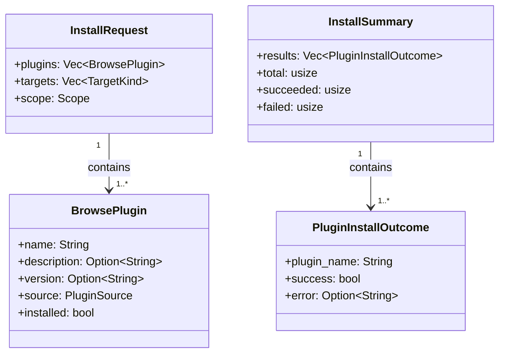
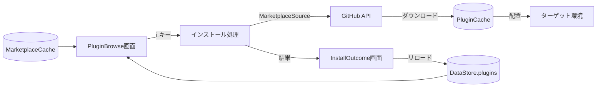

# マーケットプレイス プラグインブラウズ＆インストール - 設計仕様書

> **バージョン**: 1.0

## 1. 概要

TUI（`plm managed`）のマーケットプレイスタブに、プラグインをブラウズして対話的にインストールする機能を追加する。Claude Code のプラグインコマンドのように、マーケットプレイス内のプラグイン一覧をブラウズし、スペースで複数選択して一括インストールできるようにする。

## 2. 背景と課題

### 2.1 現状

- マーケットプレイスのプラグインをインストールするには `plm install plugin@marketplace` コマンドを手動で入力する必要がある
- プラグイン名を知るには `plm marketplace show <name>` で一覧を確認する必要がある
- TUI のマーケットプレイスタブにはプラグイン一覧表示（`PluginList`）はあるが、インストール機能はない
- 複数プラグインを一括インストールする手段がなく、1プラグインずつコマンドを打つ必要がある

### 2.2 課題

1. **プラグイン名を調べる手間**: `marketplace show` で一覧を見て、名前をコピーして `install` コマンドに渡す2ステップが煩雑
2. **一括インストール不可**: 複数プラグインをまとめてインストールできず、プラグインごとにコマンドを実行する必要がある
3. **インストール状態が見えない**: ブラウズ時にどのプラグインが既にインストール済みかわからない

### 2.3 この設計で解決すること

| Before | After |
|:-------|:------|
| `marketplace show` → 名前確認 → `install plugin@mp` を繰り返し | TUI でブラウズ → スペースで選択 → `i` で一括インストール |
| インストール済みかどうか不明 | インストール済みプラグインにマーク＋色変更で即座に判別可能 |
| ターゲットは1つずつ指定 | ターゲット複数選択で同時インストール可能 |

## 3. スコープ

### 3.1 対象

- TUI（`plm managed`）マーケットプレイスタブの拡張
  - MarketDetail 画面に「Browse plugins (N)」アクション追加
  - プラグインブラウズ画面（左右分割: リスト + 詳細パネル）
  - プラグイン複数選択（スペースキー）
  - ターゲット選択画面（チェックボックスリスト、複数選択）
  - スコープ選択画面（Personal / Project）
  - インストール実行（プログレスバー付き）
  - インストール結果サマリー画面

### 3.2 対象外

- CLIコマンドの追加・変更（`plm marketplace browse` 等の新規コマンドは作らない）
- マーケットプレイスの追加・削除・更新機能の変更
- プラグインのアンインストール機能
- プラグインの検索・フィルタ（マーケットプレイス横断検索）
- プラグインの詳細ページ（README表示等）

### 3.3 境界条件

| 境界 | 内側（この設計の責務） | 外側（他の責務） |
|:-----|:--------------------|:---------------|
| プラグインのダウンロード | ブラウズ画面からインストール処理を呼び出す | 実際のダウンロード・配置は既存の `install` ロジック |
| マーケットプレイスデータ | キャッシュ済みデータの読み取り・表示 | キャッシュの更新（既存の `update` 機能） |
| インストール状態の判定 | DataStore のプラグイン一覧と照合して表示 | プラグインの有効化・無効化・削除 |

## 4. 用語定義

| 用語 | 定義 | コード上の表現 |
|:-----|:-----|:-------------|
| ブラウズ画面 | マーケットプレイス内のプラグイン一覧を左右分割で表示する画面 | `Model::PluginBrowse` |
| プラグイン選択 | スペースキーでプラグインのインストール対象を切り替える操作 | `selected_plugins: HashSet<String>` |
| ターゲット選択 | インストール先の環境（codex, copilot等）を選ぶ画面 | `Model::TargetSelect` |
| スコープ選択 | Personal / Project のどちらにインストールするか選ぶ画面 | `Model::ScopeSelect` |
| インストール済みマーク | 既にインストール済みのプラグインに付与する視覚的マーカー | `installed: bool` フィールド |

## 5. 設計判断

### DJ-001: TUI専用（CLIコマンド追加なし）

- **判断内容**: 新規CLIコマンド（`plm marketplace browse`）は追加せず、TUI のみで対応する
- **理由**: CLIでの対話的選択UIには `dialoguer` 等の追加依存が必要。TUI（ratatui）で十分な体験が提供できる
- **検討した代替案**:
  - `plm marketplace browse` コマンド追加 → 対話的UIライブラリの追加依存が必要、TUIと機能が重複
  - `plm marketplace browse` で TUI を起動 → 既存の `plm managed` と役割が重複
- **トレードオフ**: CLI のみの環境ではブラウズインストールが使えない
- **影響範囲**: CLI定義（`cli.rs`）に変更なし

### DJ-002: MarketDetail に「Browse plugins」を追加する導線

- **判断内容**: 既存の MarketDetail 画面のアクションメニューに「Browse plugins (N)」項目を追加し、そこからブラウズ画面に遷移する
- **理由**: 既存のナビゲーションフロー（MarketList → MarketDetail）を壊さず、自然な導線として追加できる
- **検討した代替案**:
  - MarketList から直接ブラウズ画面に遷移 → MarketDetail の他のアクション（Update, Remove）へのアクセスが失われる
- **トレードオフ**: ブラウズまでに1ステップ多い（MarketDetail を経由する）
- **影響範囲**: MarketDetail のアクションメニュー、model.rs の `Model` enum

### DJ-003: 左右分割レイアウト（Claude Code スタイル）

- **判断内容**: ブラウズ画面を左右分割とし、左にプラグインリスト、右にハイライト中のプラグイン詳細パネルを表示する
- **理由**: Claude Code のプラグインブラウズUIと同じ体験を提供するため
- **検討した代替案**:
  - 上下分割（上: リスト、下: 詳細）→ リストの表示行数が減る
- **トレードオフ**: 横幅が狭い端末では詳細パネルが見づらくなる可能性
- **影響範囲**: view.rs のレイアウト実装

### DJ-004: インストール済みプラグインは選択可能（再インストール）

- **判断内容**: インストール済みのプラグインもスペースキーで選択してインストール（再インストール・更新）できるようにする
- **理由**: 別のターゲットへのインストールや、更新のために再インストールしたいケースがある
- **検討した代替案**:
  - インストール済みはグレーアウトして選択不可 → 別ターゲットへのインストールができなくなる
- **トレードオフ**: 誤って再インストールする可能性がある（ただし上書きなので破壊的ではない）
- **影響範囲**: プラグイン選択ロジック

### DJ-005: ターゲット複数選択、スコープは全プラグイン共通

- **判断内容**: ターゲットはチェックボックスで複数選択可能。スコープ（Personal/Project）は選択した全プラグインに共通で1回選択
- **理由**: 複数ターゲットへの同時インストールはよくあるユースケース。スコープはプラグインごとに変える必要性が低い
- **検討した代替案**:
  - プラグインごとにスコープ選択 → UIが煩雑になりすぎる
- **トレードオフ**: プラグインごとに異なるスコープを指定できない
- **影響範囲**: TargetSelect 画面、ScopeSelect 画面、インストール実行ロジック

### DJ-006: インストール失敗時はスキップして続行

- **判断内容**: 複数プラグインのインストール中にエラーが発生した場合、そのプラグインをスキップして残りのインストールを続行する。最後にサマリーで成功・失敗を表示
- **理由**: 1つの失敗で全体を止めるとユーザー体験が悪い。成功分は確実にインストールされるべき
- **検討した代替案**:
  - 最初の失敗で中断 → 成功したはずのプラグインもインストールされない
- **トレードオフ**: 一部失敗に気づきにくい可能性（サマリーで緩和）
- **影響範囲**: インストール実行ロジック、InstallOutcome 画面

## 6. ドメインモデル

### 6.1 モデル図



### 6.2 エンティティ定義

#### BrowsePlugin

| 属性 | 型 | 必須 | 説明 | 制約 |
|:-----|:---|:-----|:-----|:-----|
| name | String | Yes | プラグイン名 | MarketplacePlugin.name から取得 |
| description | Option\<String\> | No | プラグインの説明 | MarketplacePlugin.description から取得 |
| version | Option\<String\> | No | バージョン | MarketplacePlugin.version から取得 |
| source | PluginSource | Yes | プラグインのソース（Local/External） | MarketplacePlugin.source から取得 |
| installed | bool | Yes | インストール済みかどうか | DataStore.plugins との照合で決定 |

#### PluginInstallOutcome

| 属性 | 型 | 必須 | 説明 | 制約 |
|:-----|:---|:-----|:-----|:-----|
| plugin_name | String | Yes | プラグイン名 | |
| success | bool | Yes | インストール成功/失敗 | |
| error | Option\<String\> | No | エラーメッセージ | success=false の場合のみ |

## 7. 振る舞い仕様

### UC-001: プラグインブラウズ

**トリガー**: MarketDetail 画面で「Browse plugins (N)」を選択して Enter

**事前条件**:
- マーケットプレイスが選択済み
- マーケットプレイスのキャッシュが存在する（プラグイン一覧を取得済み）

**正常フロー**:
1. MarketDetail のアクションメニューで「Browse plugins (N)」が選択される（N はプラグイン数）
2. PluginBrowse 画面に遷移する
3. 左パネルにプラグイン一覧を表示する
   - 各プラグイン: `[ ] plugin-name  description...`
   - インストール済み: `[✓] plugin-name  description...`（色を変更、例: DarkGray）
4. 右パネルにハイライト中のプラグインの詳細を表示する
   - 名前、説明、バージョン、ソース情報
5. ↑↓キーでハイライト移動、右パネルが連動して更新される
6. スペースキーでプラグインの選択を切り替える
   - 未選択 → 選択: `[ ]` → `[x]`
   - 選択 → 未選択: `[x]` → `[ ]`
7. `i` キーでインストールフローに進む（UC-002）

**事後条件**:
- 選択状態が保持される（Back で戻って再度入っても復元される）

**代替フロー**:
- プラグインが0件の場合: 「No plugins available」メッセージを表示
- Esc/Back: MarketDetail 画面に戻る

**例外フロー**:
- キャッシュが存在しない: MarketDetail に「Browse plugins (no cache)」と表示し、選択不可にする

### UC-002: プラグインインストール

**トリガー**: PluginBrowse 画面で1つ以上のプラグインが選択された状態で `i` キーを押下

**事前条件**:
- 1つ以上のプラグインが選択されている（`selected_plugins` が空でない）

**正常フロー**:
1. `i` キーが押される
2. TargetSelect 画面に遷移する
   - 利用可能なターゲット一覧をチェックボックスで表示
   - `[ ] Codex`, `[ ] Copilot`, `[ ] Antigravity`, `[ ] Gemini CLI`
   - スペースで選択切り替え、Enter で確定
3. ScopeSelect 画面に遷移する
   - `Personal` / `Project` を選択
   - ↑↓で移動、Enter で確定
4. Installing 画面に遷移する
   - プログレスバー: `Installing plugin-name... [2/5]`
   - 各プラグインを順次インストール:
     a. MarketplaceSource を使ってダウンロード
     b. 選択された各ターゲットに配置
     c. 成功/失敗を記録
   - 失敗したプラグインはスキップして次へ進む
5. InstallOutcome 画面に遷移する
   - サマリー: `Installed 3/5 plugins successfully`
   - 成功: `✓ plugin-a` （緑）
   - 失敗: `✗ plugin-b: error message` （赤）
   - Enter で PluginBrowse 画面に戻る

**事後条件**:
- 成功したプラグインが DataStore に反映される
- PluginBrowse 画面に戻った際、インストール済みマークが更新される

**代替フロー**:
- プラグインが未選択の状態で `i`: 何もしない（ステータスバーに「No plugins selected」を表示）
- TargetSelect で何も選択せずに Enter: 何もしない（ステータスバーに「No targets selected」を表示）
- TargetSelect/ScopeSelect で Esc: PluginBrowse に戻る

**例外フロー**:
- 全プラグインのインストールが失敗: InstallOutcome で全て失敗表示、Enter で PluginBrowse に戻る

## 8. 状態遷移

### マーケットプレイスタブの画面状態

```mermaid
stateDiagram-v2
    [*] --> MarketList
    MarketList --> MarketDetail : Enter（マーケットプレイス選択）
    MarketDetail --> MarketList : Esc/Back
    MarketDetail --> PluginList : Enter（Show plugins 選択）
    PluginList --> MarketDetail : Esc/Back
    MarketDetail --> PluginBrowse : Enter（Browse plugins 選択）
    PluginBrowse --> MarketDetail : Esc/Back
    PluginBrowse --> TargetSelect : i（プラグイン選択済み）
    TargetSelect --> PluginBrowse : Esc/Back
    TargetSelect --> ScopeSelect : Enter（ターゲット選択済み）
    ScopeSelect --> TargetSelect : Esc/Back
    ScopeSelect --> Installing : Enter（スコープ選択済み）
    Installing --> InstallOutcome : インストール完了
    InstallOutcome --> PluginBrowse : Enter
    MarketDetail --> AddForm : Enter（Add new 選択）
    AddForm --> MarketList : 完了/Esc
    MarketList --> AddForm : Enter（Add new 選択）
```



| 遷移 | 開始状態 | 終了状態 | トリガー | ガード条件 | アクション |
|:-----|:---------|:---------|:---------|:----------|:----------|
| ブラウズ開始 | MarketDetail | PluginBrowse | Enter | 「Browse plugins」が選択されている | キャッシュからプラグイン一覧を取得、インストール状態を照合 |
| プラグイン選択 | PluginBrowse | PluginBrowse | Space | - | selected_plugins を更新 |
| インストール開始 | PluginBrowse | TargetSelect | `i` | selected_plugins が空でない | - |
| ターゲット確定 | TargetSelect | ScopeSelect | Enter | 1つ以上のターゲットが選択されている | - |
| スコープ確定 | ScopeSelect | Installing | Enter | スコープが選択されている | インストール処理を開始（Phase 2） |
| インストール完了 | Installing | InstallOutcome | 自動 | 全プラグインの処理が完了 | DataStore をリロード |
| 結果確認 | InstallOutcome | PluginBrowse | Enter | - | プラグイン一覧のインストール状態を更新 |
| ブラウズ終了 | PluginBrowse | MarketDetail | Esc | - | 選択状態をクリア |

**不正な遷移**:
- PluginBrowse → TargetSelect: `selected_plugins` が空の場合は遷移しない
- TargetSelect → ScopeSelect: ターゲットが未選択の場合は遷移しない

## 9. データフロー

### 9.1 全体のデータフロー



### 9.2 データ変換ルール

| 入力 | 変換処理 | 出力 | バリデーション |
|:-----|:---------|:-----|:-------------|
| MarketplaceCache.plugins | インストール状態を照合して BrowsePlugin に変換 | Vec\<BrowsePlugin\> | キャッシュが存在すること |
| 選択されたプラグイン + ターゲット + スコープ | InstallRequest を構築 | InstallRequest | plugins, targets が空でないこと |
| インストール結果 | 成功/失敗を集約 | InstallSummary | - |

## 10. エラー・例外設計

| ID | エラー | 発生条件 | 深刻度 | 対処方針 | ユーザーへの影響 |
|:---|:-------|:---------|:-------|:---------|:---------------|
| E-001 | キャッシュ未取得 | マーケットプレイスのキャッシュが存在しない | Low | 「Browse plugins (no cache)」と表示し、browseを無効化。先にupdateを促す | ブラウズ不可 |
| E-002 | ダウンロード失敗 | GitHub API エラー、ネットワークエラー | Medium | そのプラグインをスキップして次へ。結果サマリーにエラーメッセージ表示 | 該当プラグインのみ未インストール |
| E-003 | ターゲット配置失敗 | ファイルシステムエラー、パーミッション | Medium | そのプラグインをスキップして次へ。結果サマリーにエラーメッセージ表示 | 該当プラグインのみ未インストール |
| E-004 | プラグイン0件 | マーケットプレイスにプラグインが登録されていない | Low | 「No plugins available」を表示 | ブラウズ画面は表示するが空リスト |

## 11. 画面レイアウト仕様

### 11.1 PluginBrowse 画面

```
┌─ Marketplaces ─────────────────────────────────────────────────┐
│ Installed │ Discover │ [Marketplaces] │ Errors                 │
├────────────────────────────────────────────────────────────────┤
│ 🔎 Search...                                                   │
├──────────────────────────────┬─────────────────────────────────┤
│ Browse plugins (3)           │ plugin-a                        │
│                              │                                 │
│ > [x] plugin-a               │ Version: 1.0.0                  │
│   [ ] plugin-b               │ Source: local (./plugins/a)     │
│   [✓] plugin-c  (installed)  │                                 │
│                              │ A useful plugin that provides   │
│                              │ extended functionality for...   │
│                              │                                 │
├──────────────────────────────┴─────────────────────────────────┤
│ ↑↓: move  space: select  i: install  esc: back  q: quit       │
└────────────────────────────────────────────────────────────────┘
```

- **左パネル（40%幅）**: プラグインリスト
  - `[ ]` 未選択、`[x]` 選択済み、`[✓]` インストール済み（DarkGray色）
  - ハイライト行: Bold + Green
- **右パネル（60%幅）**: 詳細パネル
  - プラグイン名（Bold）、バージョン、ソース種別・パス、説明文

### 11.2 TargetSelect 画面

```
┌─ Select targets ──────────────────────┐
│ > [x] Codex                            │
│   [x] Copilot                          │
│   [ ] Antigravity                      │
│   [ ] Gemini CLI                       │
│                                        │
├────────────────────────────────────────┤
│ ↑↓: move  space: toggle  enter: ok    │
└────────────────────────────────────────┘
```

- **配置**: モーダルは `outer_rect` 全面配置（左上基準・100%×100%）。外周 1 セルのパディングは維持し、`f.render_widget(Clear, f.area())` で端末全体をクリアして前フレームの残骸を残さない。
- **行間**: Target 一覧の行間は **1 行（spacing なし）**。

### 11.3 ScopeSelect 画面

```
┌─ Select scope ────────────────────────┐
│ > Personal (~/.plm/)                   │
│   Project  (./)                        │
│                                        │
├────────────────────────────────────────┤
│ ↑↓: move  enter: select  esc: back    │
└────────────────────────────────────────┘
```

- **配置**: モーダルは `outer_rect` 全面配置（左上基準・100%×100%）。
- **行間**: Scope 一覧の行間は **1 行（spacing なし）**。

### 11.4 Installing 画面

```
┌─ Installing ──────────────────────────┐
│                                        │
│ Installing plugin-b...                 │
│ ████████░░░░░░░░░░░░  2/5             │
│                                        │
│ (残り余白)                              │
└────────────────────────────────────────┘
```

- **配置**: モーダルは `outer_rect` 全面配置（左上基準・100%×100%）。
- **内側レイアウト**: `Title+Text 4 行` + `Gauge 3 行` + `Min(0)（残り余白）` で構成。`gauge` は **固定 3 行**を維持し、残り領域は意図的に空白のままとする。

### 11.5 InstallOutcome 画面

```
┌─ Install Result ──────────────────────┐
│                                        │
│ Installed 3/5 plugins                  │
│                                        │
│ ✓ plugin-a                             │
│ ✓ plugin-b                             │
│ ✓ plugin-d                             │
│ ✗ plugin-c: Network error              │
│ ✗ plugin-e: Permission denied          │
│                                        │
├────────────────────────────────────────┤
│ enter: back to browse                  │
└────────────────────────────────────────┘
```

- **配置**: モーダルは `outer_rect` 全面配置（左上基準・100%×100%）。コンテンツは上から自然に伸びる。

## 12. キーバインド仕様

### PluginBrowse 画面

| キー | アクション | 条件 |
|:-----|:----------|:-----|
| ↑ / k | 前のプラグインにハイライト移動 | - |
| ↓ / j | 次のプラグインにハイライト移動 | - |
| Space | ハイライト中のプラグインの選択をトグル | - |
| i | インストールフロー開始（TargetSelect へ遷移） | 1つ以上のプラグインが選択されている |
| Esc | MarketDetail に戻る | - |

### TargetSelect 画面

| キー | アクション | 条件 |
|:-----|:----------|:-----|
| ↑ / k | 前のターゲットにハイライト移動 | - |
| ↓ / j | 次のターゲットにハイライト移動 | - |
| Space | ハイライト中のターゲットの選択をトグル | - |
| Enter | 確定して ScopeSelect へ遷移 | 1つ以上のターゲットが選択されている |
| Esc | PluginBrowse に戻る | - |

### ScopeSelect 画面

| キー | アクション | 条件 |
|:-----|:----------|:-----|
| ↑ / k | 前のスコープにハイライト移動 | - |
| ↓ / j | 次のスコープにハイライト移動 | - |
| Enter | 確定してインストール開始 | - |
| Esc | TargetSelect に戻る | - |

### InstallOutcome 画面

| キー | アクション | 条件 |
|:-----|:----------|:-----|
| Enter | PluginBrowse に戻る | - |
| Esc | PluginBrowse に戻る | - |

## 13. 制約条件

| 制約 | 内容 | 影響する設計判断 |
|:-----|:-----|:---------------|
| Elm Architecture | 既存TUIは Elm Architecture（Model/Msg/update/view）に従っている | 全ての新規画面状態はこのパターンに従う |
| 2段階実行パターン | 非同期操作は Phase 1（UI更新）→ 描画 → Phase 2（実行）で行う | DJ-006: インストール実行は Phase 2 で行う |
| ratatui | TUI フレームワークは ratatui を使用 | DJ-003: レイアウトは Layout + Constraint で実現 |
| 同期的なインストール | 現在のインストール処理は `tokio::runtime::Runtime::new()` でブロッキング実行 | Installing 画面はプログレスバーの更新タイミングに制約あり |

## 14. 未決事項

| ID | 未決事項 | 影響範囲 | 暫定方針 |
|:---|:---------|:---------|:---------|
| TBD-001 | インストール処理のプログレスバー更新タイミング | Installing 画面 | プラグイン単位で更新（1プラグインのインストール完了ごとに描画更新） |
| TBD-002 | 端末幅が狭い場合の詳細パネル表示 | PluginBrowse のレイアウト | 最小幅以下の場合は詳細パネルを非表示にしてリストのみ表示 |

## 15. 参考資料

- 既存マーケットプレイスTUI: `src/tui/manager/screens/marketplaces/`
- 既存インストール処理: `src/commands/install.rs`
- マーケットプレイスレジストリ: `src/marketplace/registry.rs`
- プラグインソース: `src/source/marketplace_source.rs`
- TUIコアモジュール: `src/tui/manager/core/`
- 既存ダイアログ: `src/tui/dialog.rs`（SelectItem/MultiSelect パターン参考）
