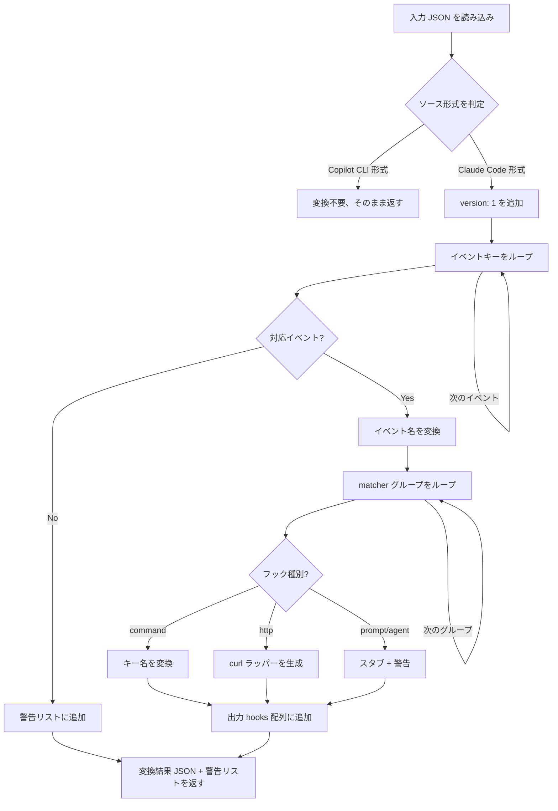

# Hooks 自動変換 - 設定構造変換仕様

> **機能**: [Hooks 自動変換](./index.md)
> **ステータス**: 下書き

## 概要

Claude Code 形式の Hooks 設定 JSON を Copilot CLI 形式の JSON に変換するコアロジック。イベント名・キー名・構造・フック種別の変換を担う。

## ビジネスロジック

### BL-001: ソース形式の自動判定

入力 JSON が Claude Code 形式か Copilot CLI 形式かを自動判定する。

| 条件 | 判定結果 |
|------|---------|
| トップレベルに `"version"` キーが存在する | Copilot CLI 形式（変換不要） |
| イベントキーが PascalCase（例: `PreToolUse`） | Claude Code 形式（変換対象） |
| イベントキーが camelCase（例: `preToolUse`） | Copilot CLI 形式（変換不要） |

### BL-002: トップレベル構造の変換

```
入力（Claude Code）:
{
  "hooks": { ... }
}

出力（Copilot CLI）:
{
  "version": 1,
  "hooks": { ... }
}
```

- `"version": 1` を追加
- `disableAllHooks` フィールドがある場合は除去（Copilot CLI に対応なし、警告を出力）

### BL-003: イベント名の変換

| Claude Code (入力) | Copilot CLI (出力) | 備考 |
|--------------------|-------------------|------|
| `SessionStart` | `sessionStart` | |
| `SessionEnd` | `sessionEnd` | |
| `PreToolUse` | `preToolUse` | |
| `PostToolUse` | `postToolUse` | |
| `UserPromptSubmit` | `userPromptSubmitted` | 末尾が異なる (`Submit` → `Submitted`) |
| `Stop` | `agentStop` | 名前が異なる |
| `SubagentStop` | `subagentStop` | |
| `PostToolUseFailure` | — | 除外 + 警告 |
| `PreCompact` / `PostCompact` | — | 除外 + 警告 |
| `PermissionRequest` | — | 除外 + 警告 |
| `Notification` | — | 除外 + 警告 |
| `SubagentStart` | — | 除外 + 警告 |
| `TeammateIdle` | — | 除外 + 警告 |
| `TaskCompleted` | — | 除外 + 警告 |
| `InstructionsLoaded` | — | 除外 + 警告 |
| `ConfigChange` | — | 除外 + 警告 |
| `WorktreeCreate` / `WorktreeRemove` | — | 除外 + 警告 |
| `Elicitation` / `ElicitationResult` | — | 除外 + 警告 |

### BL-004: matcher グループのフラット化

Claude Code の matcher グループ構造を Copilot CLI のフラット配列に展開する。

```
入力（Claude Code）:
"PreToolUse": [
  {
    "matcher": "Bash",
    "hooks": [
      { "type": "command", "command": "./validate-bash.sh" }
    ]
  },
  {
    "matcher": "Write|Edit",
    "hooks": [
      { "type": "command", "command": "./validate-write.sh" }
    ]
  }
]

出力（Copilot CLI）:
"preToolUse": [
  { "type": "command", "bash": "./wrappers/validate-bash.sh" },
  { "type": "command", "bash": "./wrappers/validate-write.sh" }
]
```

**matcher の扱い:**
- matcher 情報はラッパースクリプト内のフィルタロジックに移動する（[script-wrapper-spec.md](./script-wrapper-spec.md) 参照）
- matcher が空文字列または省略の場合は全マッチ（フィルタなし）

### BL-005: フック定義のキー名変換

| Claude Code | Copilot CLI | 変換ルール |
|-------------|-------------|-----------|
| `"type": "command"` | `"type": "command"` | そのまま |
| `"command"` | `"bash"` | キー名変更 |
| `"timeout"` | `"timeoutSec"` | キー名変更（値はそのまま、単位は秒で同一） |
| `"statusMessage"` | `"comment"` | キー名変更（近似マッピング） |
| `"async": true` | — | 除去（Copilot CLI に対応なし、警告） |
| `"once": true` | — | 除去（Copilot CLI に対応なし） |

### BL-006: フック種別の変換

| Claude Code の種別 | 変換方法 |
|-------------------|---------|
| `command` | そのまま変換（キー名のみ変更） |
| `prompt` | `command` フック + プロンプト評価ラッパースクリプトに変換（後述） |
| `http` | `command` フック + `curl` ラッパースクリプトに変換 |
| `agent` | `command` フック + エージェント呼び出しラッパースクリプトに変換 |

#### `http` フックの変換例

```
入力（Claude Code）:
{
  "type": "http",
  "url": "http://localhost:8080/webhook",
  "headers": { "Authorization": "Bearer $TOKEN" },
  "timeout": 30
}

出力（Copilot CLI）:
{
  "type": "command",
  "bash": "./wrappers/http-webhook.sh",
  "timeoutSec": 30
}
```

生成される `http-webhook.sh`:
```bash
#!/bin/bash
INPUT=$(cat)
RESPONSE=$(echo "$INPUT" | curl -s -X POST \
  -H "Content-Type: application/json" \
  -H "Authorization: Bearer $TOKEN" \
  -d @- \
  "http://localhost:8080/webhook")
echo "$RESPONSE"
```

#### `prompt` / `agent` フックの変換

`prompt` / `agent` フックは Claude Code 固有の LLM 評価機能に依存するため、完全な変換は不可能。以下の方針で処理する:

- 変換時に警告を出力: `"prompt/agent フックは Claude Code 固有機能です。手動でスクリプトに書き換えてください"`
- `command` フックとしてスタブスクリプトを生成（常に exit 0 = 許可を返す）
- スタブスクリプト内にコメントで元の prompt/agent 設定を記録

### 処理フロー



## エラーハンドリング

| エラーケース | 発生条件 | 振る舞い |
|:------------|:---------|:---------|
| JSON パースエラー | 入力が不正な JSON | エラーを返す（変換中止） |
| 未知のイベント名 | マッピングテーブルにないイベント | 警告を出力し、そのイベントを除外 |
| 未知のフック種別 | `command`/`http`/`prompt`/`agent` 以外 | 警告を出力し、そのフックを除外 |
| `command` フィールド欠落 | `type: "command"` だが `command` キーがない | エラーを返す |
| `url` フィールド欠落 | `type: "http"` だが `url` キーがない | エラーを返す |

## 制限事項

- Claude Code の `prompt` / `agent` フックは完全な変換ができない（LLM 依存のため）
- `async: true`（非同期実行）は Copilot CLI に対応がないため除去される
- `disableAllHooks` は Copilot CLI に対応がないため除去される
- `powershell` キーは生成しない（bash のみ）

## 関連仕様

- [script-wrapper-spec.md](./script-wrapper-spec.md) - 変換で生成されるラッパースクリプトの仕様
- [install-integration-spec.md](./install-integration-spec.md) - PLM install フローとの統合
- [hooks-schema-mapping.md](../reference/hooks-schema-mapping.md) - 詳細なスキーマ対応表
