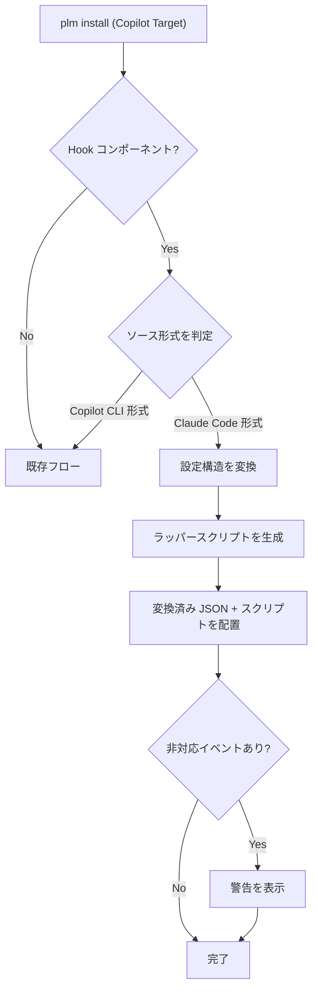

# Hooks 自動変換機能

> **バージョン**: 1.0
> **作成日**: 2026-03-15
> **ステータス**: 下書き

## 概要

PLM の `install` コマンド実行時に、Claude Code 形式の Hooks 設定ファイルをターゲット環境の形式に自動変換して配置する機能。プラグイン作者は Claude Code 形式で Hooks を記述するだけで、複数の AI 開発環境ユーザーにそのまま配布できるようになる。

現在、変換のターゲットとして以下を想定する:

- **Copilot CLI**（実装済み）: camelCase 化・matcher のフラット化・ラッパースクリプト生成を行う、最も差異が大きい変換。
- **OpenAI Codex CLI**（実装済み）: Claude Code 形式の PascalCase イベント名 + matcher グループ構造をほぼそのまま保持し、`.codex/hooks.json` に配置する。
- **Google Antigravity**（公式サポート / PLM 未対応）: Antigravity 2.0 が hooks を公式サポートし始めたが、PLM の変換は未実装（今後対応予定。関連 issue は別途登録）。

> 出典: Codex は https://developers.openai.com/codex/hooks 、Antigravity は https://antigravity.google/docs/hooks 等。Codex / Antigravity の公式ドメインは bot 対策で取得が制限されるため、検索スニペット・GitHub Issue・公式フォーラム等とクロスチェックした内容に基づく。

## 背景

Claude Code・Copilot CLI・Codex CLI はいずれも Hooks（エージェントセッションのライフサイクルイベントに対するフック）をサポートしているが、スキーマにそれぞれ差異がある。

Claude Code → Copilot CLI で吸収が必要な主な差異:

- **イベント名**: PascalCase (`PreToolUse`) vs camelCase (`preToolUse`)
- **設定構造**: matcher グループによるネスト vs フラット配列
- **stdin/stdout スキーマ**: フィールド名・値の型が異なる（`tool_input` オブジェクト vs `toolArgs` JSON文字列）
- **exit code の意味**: Claude Code は exit 2 でブロック、Copilot CLI は JSON 出力で deny
- **フック種別**: Claude Code は `command`/`http`/`prompt`/`agent` の 4 種、Copilot CLI は `command`/`prompt` の 2 種

一方 Codex CLI は Claude Code と同様に PascalCase イベント名 + matcher グループ構造を採用しているため、構造変換の必要が小さく、ラッパースクリプトも生成しない（後述の比較表を参照）。

現状、ユーザーがこれらの差異を手動で変換する必要があり、ミスが発生しやすい。

詳細なスキーマ対応表: [hooks-schema-mapping.md](../reference/hooks-schema-mapping.md)

### ターゲットごとの変換方針

| ターゲット | イベント名 | 構造 | スクリプト生成 | PLM 実装状況 |
|:-----------|:-----------|:-----|:---------------|:-------------|
| Copilot CLI | camelCase 化 | matcher をフラット化 | ラッパースクリプトを生成 | 実装済み |
| Codex CLI | PascalCase を保持 | matcher グループを保持 | 生成しない（JSON inline 保持） | 実装済み |
| Google Antigravity | （未定） | （未定） | （未定） | 未対応（対応予定） |

## スコープ

**対象範囲**:
- `plm install` 時の Claude Code 形式からターゲット形式への自動変換
- Copilot CLI への変換（設定 JSON 構造の変換、stdin/stdout スキーマ差分を吸収するラッパースクリプト生成、ツール名・exit code のブリッジ）
- Codex CLI への変換（`.codex/hooks.json` への配置。PascalCase イベント名・matcher グループ構造を保持し、キー名のみ正規化）
- 全イベントのベストエフォート変換（非対応イベントは警告付きで除外）

**対象外 / 制約**:
- Copilot CLI / Codex CLI → Claude Code 方向の逆変換
- 専用 CLI コマンド（`plm convert-hooks` 等）の提供
- VSCode Agent Mode 形式（PascalCase + `command` キー）への変換
- 既存の Copilot Hooks 配置機能（JSON ファイルのそのままコピー）の変更
- Google Antigravity 向けの変換（PLM 未実装）
- Codex の制約: 対応イベントは現状 6 種（`SessionStart`/`PreToolUse`/`PostToolUse`/`UserPromptSubmit`/`Stop`/`PermissionRequest`）に限られ、`PreCompact`/`PostCompact`/`SubagentStop`/`SubagentStart` や `config.toml` 形式・feature flag 案内は未対応

## ユーザーストーリー

| ID | ～として | ～したい | ～のために | 優先度 |
|:---|:---------|:---------|:-----------|:-------|
| US-001 | プラグイン利用者 | Claude Code 形式の Hooks を Copilot CLI 環境にインストールしたい | 手動でスキーマを変換せずに済むように | 高 |
| US-002 | プラグイン利用者 | 非対応イベントがある場合に警告を受け取りたい | 変換で欠落した機能を把握できるように | 中 |
| US-003 | プラグイン作者 | Claude Code 形式だけで Hooks を記述したい | 複数環境向けに同じフックを配布できるように | 高 |

## 処理フロー

以下は Copilot CLI ターゲットのフロー（最も変換工程が多いケース）。Codex CLI ターゲットでも入口（Hook コンポーネント判定・ソース形式判定）は共通だが、「ラッパースクリプトを生成」の工程はなく、matcher グループ構造を保持したまま `.codex/hooks.json` を配置する点が異なる。

### ソース形式の判定

| 判定基準 | Claude Code 形式 | Copilot CLI 形式 |
|---------|------------------|-----------------|
| `version` キー | なし | `1` が存在 |
| イベント名 | PascalCase (`PreToolUse`) | camelCase (`preToolUse`) |
| フック定義 | `matcher` + `hooks[]` のネスト | フラット配列 |

## 仕様書一覧

| 仕様書 | 説明 |
|:-------|:-----|
| [config-converter-spec.md](./config-converter-spec.md) | 設定 JSON 構造の変換ロジック（イベント名・キー名・フック種別・構造変換） |
| [script-wrapper-spec.md](./script-wrapper-spec.md) | ラッパースクリプト生成（stdin/stdout スキーマ変換・ツール名・exit code） |
| [install-integration-spec.md](./install-integration-spec.md) | PLM install フローとの統合・CopilotTarget デプロイメント |

## 用語集

| 用語 | 定義 |
|:-----|:-----|
| Hooks | エージェントセッションのライフサイクルイベントに対してシェルコマンド等を実行する仕組み |
| matcher | Claude Code 固有の機能。正規表現でツール名等をフィルタリングする仕組み |
| ラッパースクリプト | 元のフックスクリプトを呼び出す前後に stdin/stdout のスキーマ変換を行うスクリプト |
| ベストエフォート変換 | 対応イベントは変換し、非対応イベントは警告付きで除外する方式 |
