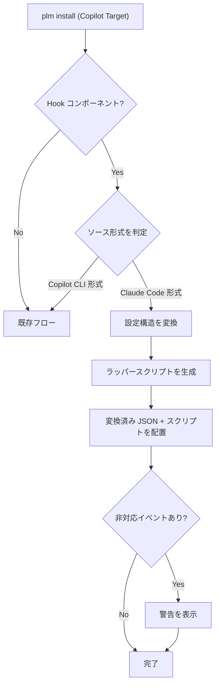

# Hooks 自動変換機能

> **バージョン**: 1.0
> **作成日**: 2026-03-15
> **ステータス**: 下書き

## 概要

PLM の `install` コマンド実行時に、Claude Code 形式の Hooks 設定ファイルを Copilot CLI 形式に自動変換して配置する機能。プラグイン作者は Claude Code 形式で Hooks を記述するだけで、Copilot CLI ユーザーにもそのまま配布できるようになる。

## 背景

Claude Code と Copilot CLI は Hooks（エージェントセッションのライフサイクルイベントに対するフック）をサポートしているが、両者のスキーマには以下の差異がある:

- **イベント名**: PascalCase (`PreToolUse`) vs camelCase (`preToolUse`)
- **設定構造**: matcher グループによるネスト vs フラット配列
- **stdin/stdout スキーマ**: フィールド名・値の型が異なる（`tool_input` オブジェクト vs `toolArgs` JSON文字列）
- **exit code の意味**: Claude Code は exit 2 でブロック、Copilot CLI は JSON 出力で deny
- **フック種別**: Claude Code は `command`/`http`/`prompt`/`agent` の 4 種、Copilot CLI は `command`/`prompt` の 2 種

現状、ユーザーがこれらの差異を手動で変換する必要があり、ミスが発生しやすい。

詳細なスキーマ対応表: [hooks-schema-mapping.md](../reference/hooks-schema-mapping.md)

## スコープ

**対象範囲**:
- `plm install` 時の Claude Code → Copilot CLI 形式への自動変換
- 設定 JSON 構造の変換（イベント名・キー名・フック種別）
- stdin/stdout スキーマ差分を吸収するラッパースクリプトの生成
- ツール名・exit code のブリッジ
- 全イベントのベストエフォート変換（非対応イベントは警告付きで除外）

**対象外**:
- Copilot CLI → Claude Code 方向の逆変換
- 専用 CLI コマンド（`plm convert-hooks` 等）の提供
- VSCode Agent Mode 形式（PascalCase + `command` キー）への変換
- 既存の Copilot Hooks 配置機能（JSON ファイルのそのままコピー）の変更

## ユーザーストーリー

| ID | ～として | ～したい | ～のために | 優先度 |
|:---|:---------|:---------|:-----------|:-------|
| US-001 | プラグイン利用者 | Claude Code 形式の Hooks を Copilot CLI 環境にインストールしたい | 手動でスキーマを変換せずに済むように | 高 |
| US-002 | プラグイン利用者 | 非対応イベントがある場合に警告を受け取りたい | 変換で欠落した機能を把握できるように | 中 |
| US-003 | プラグイン作者 | Claude Code 形式だけで Hooks を記述したい | 複数環境向けに同じフックを配布できるように | 高 |

## 処理フロー

### ソース形式の判定

| 判定基準 | Claude Code 形式 | Copilot CLI 形式 |
|---------|------------------|-----------------|
| `version` キー | なし | `1` が存在 |
| イベント名 | PascalCase (`PreToolUse`) | camelCase (`preToolUse`) |
| フック定義 | `matcher` + `hooks[]` のネスト | フラット配列 |

## 仕様書一覧

| 仕様書 | 説明 |
|:-------|:-----|
| [config-converter-spec.md](./config-converter-spec.md) | 設定 JSON 構造の変換ロジック（イベント名・キー名・フック種別・構造変換） |
| [script-wrapper-spec.md](./script-wrapper-spec.md) | ラッパースクリプト生成（stdin/stdout スキーマ変換・ツール名・exit code） |
| [install-integration-spec.md](./install-integration-spec.md) | PLM install フローとの統合・CopilotTarget デプロイメント |

## 用語集

| 用語 | 定義 |
|:-----|:-----|
| Hooks | エージェントセッションのライフサイクルイベントに対してシェルコマンド等を実行する仕組み |
| matcher | Claude Code 固有の機能。正規表現でツール名等をフィルタリングする仕組み |
| ラッパースクリプト | 元のフックスクリプトを呼び出す前後に stdin/stdout のスキーマ変換を行うスクリプト |
| ベストエフォート変換 | 対応イベントは変換し、非対応イベントは警告付きで除外する方式 |
