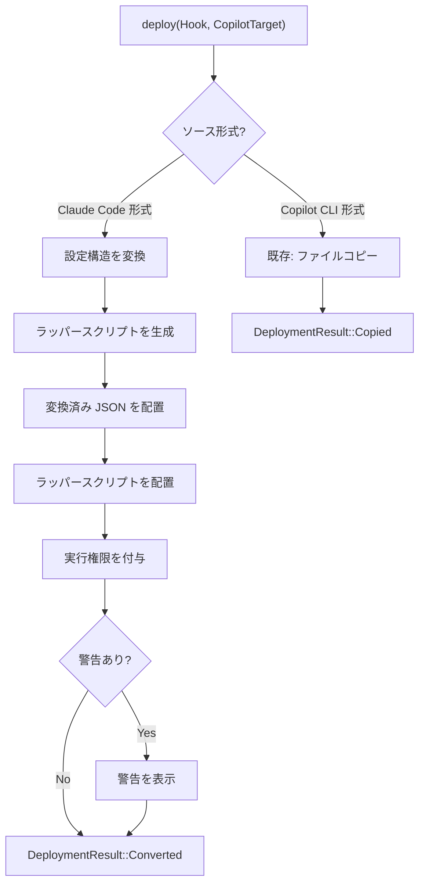
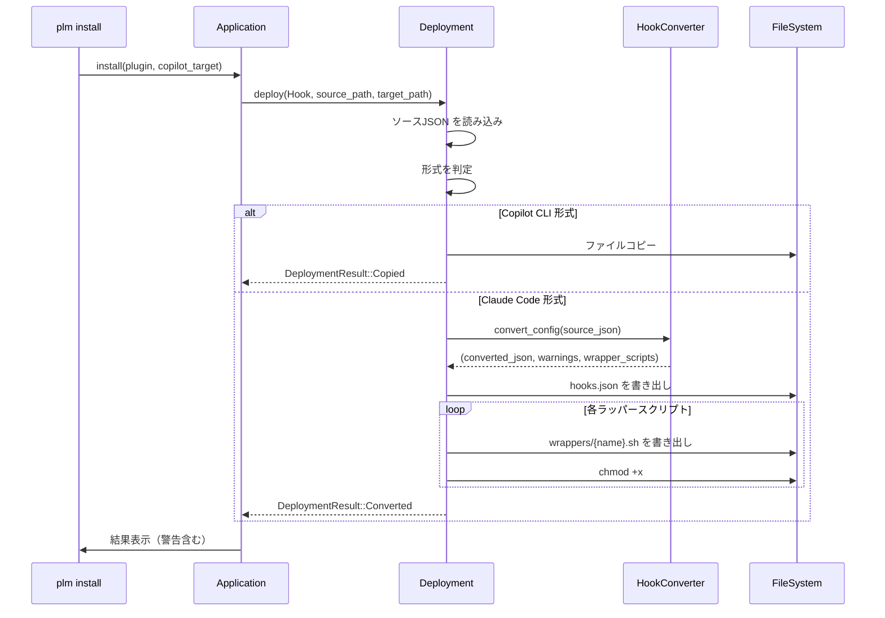

# Hooks 自動変換 - install 統合仕様

> **機能**: [Hooks 自動変換](./index.md)
> **ステータス**: 下書き

## 概要

PLM の `install` コマンドで Copilot ターゲットに Hook コンポーネントを配置する際、ソースが Claude Code 形式の場合に自動変換を実行する。既存の Copilot Hooks 配置フロー（JSON ファイルのそのままコピー）には影響しない。

## ビジネスロジック

### BL-001: 変換の発動条件

Hook コンポーネントの配置時に、以下の条件をすべて満たす場合に自動変換を実行する。

| 条件 | 判定方法 |
|------|---------|
| ターゲットが Copilot | `CopilotTarget` へのデプロイ |
| コンポーネント種別が Hook | `ComponentKind::Hook` |
| ソース形式が Claude Code | [BL-001 (config-converter)](./config-converter-spec.md) の判定ロジック |

Copilot CLI 形式のソースはこれまで通りファイルコピーで配置する（既存動作を維持）。

### BL-002: デプロイメントフローの拡張

既存の `ComponentKind::Hook` のデプロイ処理（`deployment.rs`）を拡張する。



### BL-003: 配置先ディレクトリ構造

変換後のファイルは既存の Copilot Hooks 配置パスに準拠する。

**Project スコープ:**
```
{project}/.github/hooks/{marketplace}/{plugin}/
├── hooks.json
└── wrappers/
    ├── {hook-name-1}.sh
    └── {hook-name-2}.sh
```

**Personal スコープ:**
```
~/.copilot/hooks/{marketplace}/{plugin}/
├── hooks.json
└── wrappers/
    ├── {hook-name-1}.sh
    └── {hook-name-2}.sh
```

### BL-004: `@@PLUGIN_ROOT@@` プレースホルダーの解決

ラッパースクリプト内の `@@PLUGIN_ROOT@@` を配置時にプラグインキャッシュの実パスに置換する。

```rust
// 配置時の処理イメージ
let plugin_root = cached_plugin.root_dir();
let wrapper_content = generated_wrapper
    .replace("@@PLUGIN_ROOT@@", &plugin_root.display().to_string());
```

### BL-005: DeploymentResult の拡張

変換デプロイの結果を既存の `DeploymentResult` enum に追加する。

```rust
pub enum DeploymentResult {
    Copied,      // 既存: ファイルコピー
    Converted,   // 新規: Claude Code → Copilot CLI 変換
    // ...
}
```

`Converted` の場合、コマンド出力に変換サマリーを表示する:
```
  ✓ Hook "pre-tool-use" installed (converted from Claude Code format)
    ⚠ 3 events skipped (not supported in Copilot CLI): Notification, PreCompact, SubagentStart
```

### BL-006: 元スクリプトへのパス解決

ラッパースクリプトから元のフックスクリプトを呼び出すため、プラグインキャッシュ内のスクリプトパスを解決する。

| スクリプト指定方法 | 解決ルール |
|-------------------|----------|
| 相対パス (`./scripts/validate.sh`) | `{plugin_cache_root}/{relative_path}` に解決 |
| 絶対パス (`/usr/local/bin/hook`) | そのまま使用 |
| コマンド名のみ (`npm test`) | PATH から検索（そのまま使用） |

### 処理フロー



## モジュール構成

```
src/
├── hooks/                    # 新規モジュール
│   ├── converter.rs          # 設定構造変換ロジック (config-converter-spec)
│   ├── wrapper.rs            # ラッパースクリプト生成 (script-wrapper-spec)
│   └── event_map.rs          # イベント名・ツール名マッピングテーブル
├── hooks.rs                  # mod hooks の定義
├── component/
│   └── deployment.rs         # [変更] Hook デプロイに変換分岐を追加
└── target/
    └── copilot.rs            # [変更なし] 既存の placement_location を使用
```

**既存ファイルへの変更:**
- `component/deployment.rs`: `ComponentKind::Hook` のデプロイ処理に Claude Code 形式判定と変換ロジック呼び出しを追加

**新規ファイル:**
- `hooks.rs` + `hooks/`: Hooks 変換のコアロジック
- `hooks/converter.rs`: JSON 構造変換
- `hooks/wrapper.rs`: ラッパースクリプト生成
- `hooks/event_map.rs`: イベント名・ツール名のマッピング定数

## エラーハンドリング

| エラーケース | 発生条件 | 振る舞い |
|:------------|:---------|:---------|
| ソース JSON 読み込み失敗 | ファイルが存在しない / 読み取り権限なし | エラーを返す（インストール中止） |
| ソース JSON パースエラー | 不正な JSON | エラーを返す（インストール中止） |
| 変換後 JSON 書き込み失敗 | ディスク容量不足 / 書き込み権限なし | エラーを返す（インストール中止） |
| ラッパースクリプト書き込み失敗 | 同上 | エラーを返す（インストール中止） |
| 全イベントが非対応 | Claude Code 固有イベントのみの設定 | 警告を出力し、空の hooks.json を配置 |

## 制限事項

- 変換は `install` 時のみ実行される（`update` 時も同じロジックを適用するが、既存の変換結果は上書きされる）
- `uninstall` 時は通常のファイル削除で対応（`wrappers/` ディレクトリも削除対象）
- `list` コマンドでは変換元の形式を表示しない（通常の Hook として一覧表示）

## 関連仕様

- [config-converter-spec.md](./config-converter-spec.md) - 設定構造の変換ロジック
- [script-wrapper-spec.md](./script-wrapper-spec.md) - ラッパースクリプト生成
- [hooks-schema-mapping.md](../reference/hooks-schema-mapping.md) - 詳細なスキーマ対応表
- [impl-copilot-hooks.md](../impl-copilot-hooks.md) - 既存の Copilot Hooks 配置仕様（JSON コピー）
