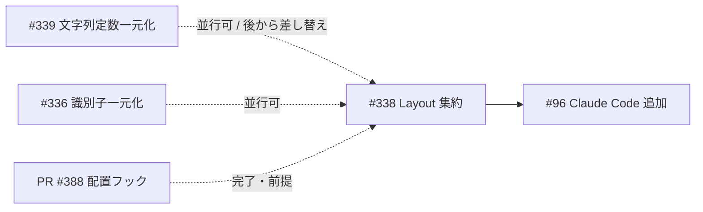

# 移行計画

> **機能**: [Target Layout 宣言的ケイパビリティ集約](./index.md)  
> **ステータス**: 計画（未実装）

## 方針

- **振る舞い不変**: パス・サポート可否・list 結果を変えない
- **スライス移行**: ターゲットを 1 つずつ共通ヘルパへ載せ替え、各ステップでテスト緑を維持
- **単純なものから**: Antigravity → Gemini CLI → Codex → Copilot → Cursor
- **ビッグバン禁止**: 5 ファイル同時書き換えの単一 PR は避ける（レビュー不能になる）

## Phase 一覧

| Phase | タイトル | 成果物 | blocked_by |
|:------|:---------|:-------|:-----------|
| 0 | 仕様凍結・受け入れテスト棚卸し | 本ディレクトリの仕様、現状マトリクスと既存テストの対応表 | — |
| 1 | `TargetLayout` 型と導出ヘルパ（テスト先行） | `src/target/layout/`、テーブル駆動ユニットテスト | Phase 0 |
| 2 | Antigravity / Gemini CLI 移行 | 2 env が LAYOUT 駆動。重複 `filter_component` 削除開始 | Phase 1 |
| 3 | Codex / Copilot 移行 | Instruction・Hook 規則を含む。`placed_common` 縮小 | Phase 2 |
| 4 | Cursor 移行 | `OriginalNameRequired` / `PlainMarkdownFile` を含む最終形 | Phase 3 |
| 5 | trait デフォルト接続とダミー廃止 | `supports_scope` を capabilities 導出へ。プロービング削除 | Phase 4 |
| 6 | ドキュメント同期・掃除 | `core-design.md` / `targets.md` 更新、死コード削除 | Phase 5 |

各 Phase は独立 PR を推奨。Issue #338 を Epic 相当として Sub-issue を切ってもよい。

---

## Phase 0 — 仕様凍結・棚卸し

### 作業

1. 本仕様（index / capability-model / migration）をレビューし、BL-005 マトリクスを承認する
2. 既存テストをマトリクスにマッピングする（不足があれば**期待値固定のテストを先に追加**）

### 必須カバレッジ（受け入れ）

各ターゲットについて最低限:

| カテゴリ | 内容 |
|----------|------|
| T-SUP | `supported_components` の集合 |
| T-SCOPE | 各 kind × Personal/Project の `supports_scope` / `placement_location` 有無 |
| T-PATH | 代表的な `placement_location` パス文字列 |
| T-LIST | 空ディレクトリ / 存在する Skill / Instruction 有無 / 非サポート kind は空 |

Cursor は追加で:

- Skill: `original_name` 欠落時は `None`
- Agent/Command: `.agent.md` / `.prompt.md` が list に載らない

### Done

- [ ] マトリクス承認
- [ ] 不足テストの追加 PR（あれば）が main に入っている

---

## Phase 1 — モデルと導出ヘルパ

### Red → Green

1. **Red**: `layout/derive_test.rs` に「架空の小さな `TargetLayout`」で placement / list / supports を検証するテストを書く
2. **Green**: `TargetLayout` と導出関数を実装
3. **Refactor**: enum 名やモジュール分割を整える

### 実装メモ

- この Phase では**既存 env をまだ書き換えない**
- `scan_components` を再利用する
- Instruction パス計算は layout から直接行い、`Target` trait を呼ばない

### Done

- [ ] `cargo test` で layout 単体テストが通る
- [ ] 既存 env テストが無変更で通る

---

## Phase 2 — Antigravity / Gemini CLI

### 理由

- サポート kind が少なく（Skill のみ / Skill+Instruction）、振る舞いフックがない
- `filter_component` がほぼ同一で効果が見えやすい

### 作業

1. 各 env に `LAYOUT` 定数を定義（BL-005 準拠）
2. `placement_location` / `list_placed` / `supported_components` をヘルパ呼び出しに置換
3. ローカル `can_place` / `filter_component` / `base_dir` を削除

### Done

- [ ] `antigravity_test` / `gemini_cli_test` がパス
- [ ] 当該 2 ファイルから list/place 骨格のコピペが消えている

---

## Phase 3 — Codex / Copilot

### 作業

1. Codex: Skill/Agent/Instruction/Hook + `FixedAtBase` hooks
2. Copilot: スコープ制約（Skill/Command/Instruction は ProjectOnly）+ `prompts` subdir + 分散 Hook
3. `placed_common::list_instruction` の呼び出しを layout 導出に置換（この Phase で Codex/Copilot/Gemini が揃えば `placed_common` を Cursor 待ちで薄く残してもよい）

### 注意

- Codex の `pre_place_check` / `post_place` / `component_conflict_error` は**触らない**
- `supported_components` の順序がテストで固定されている場合は順序も維持する

### Done

- [ ] `codex_test` / `copilot_test` がパス
- [ ] Instruction 存在確認がダミー origin に依存しない（移行済みターゲット範囲）

---

## Phase 4 — Cursor

### 作業

1. `NamingPolicy::OriginalNameRequired` を Skill に適用
2. `PlainMarkdownFile` を Agent/Command に適用
3. Instruction ProjectOnly + Hook `FixedAtBase`
4. 振る舞いフック（Skill/Hook overwrite、legacy cleanup）は現状のまま

### Done

- [ ] `cursor_test` がパス（#377 系の original_name テスト含む）
- [ ] 5 env すべてが LAYOUT 駆動

---

## Phase 5 — trait 接続とダミー廃止

### 作業

1. `Target::supports_scope` デフォルト実装を capabilities 参照に変更
2. 必要なら `fn layout(&self) -> &'static TargetLayout` を trait に追加
3. `placed_common` のダミー context を削除。モジュールが空なら削除
4. 全ターゲットで `supports(kind) == supported_components.contains` かつ  
   `supports_scope(kind, scope) == placement_location(...).is_some()`（命名前提を満たす context で）をテストで固定

### 不変条件テスト（新規推奨）

```text
FOR target IN all_targets():
  FOR kind IN ComponentKind::ALL:
    assert_eq!(
      target.supports(kind),
      target.supported_components().contains(&kind)
    )
    FOR scope IN [Personal, Project]:
      // Flattened / Instruction / Fixed 用の valid context
      let placeable = target.placement_location(&valid_ctx).is_some()
      assert_eq!(target.supports_scope(kind, scope), placeable)
```

Cursor Skill は `original_name` 付き context で検証する。

### Done

- [ ] リポジトリ全体から `PluginOrigin::from_marketplace("test", "test")` のサポート判定用途が消える
- [ ] 上記不変条件テストが通る

---

## Phase 6 — ドキュメントと掃除

### 作業

1. `docs/architecture/core-design.md` の Target 節に `TargetLayout` 概要を追加
2. `docs/concepts/targets.md` のサポート表が BL-005 と一致することを確認（文言のみ調整）
3. 本ディレクトリのステータスを「実装済み」に更新し、必要なら要約を `docs/old/` へ移す運用に従う

### Done

- [ ] 設計ドキュメントが実装と一致
- [ ] 死コード・未使用 import なし

---

## リスクと緩和

| リスク | 影響 | 緩和 |
|--------|------|------|
| Cursor Skill の命名例外を一般化しすぎる | 他ターゲットの配置が壊れる | `NamingPolicy` を明示しデフォルトは `FlattenedName` |
| Copilot の scope 制約を `supported_components` に誤って落とす | Personal で Skill が「非サポート」扱いになる | BL-005 注記どおり「いずれかの scope で可」定義をテスト固定 |
| Instruction を name 依存にしてしまう | list が壊れる | `InstructionFile` 規則は name 非依存を型で強制 |
| #339 と定数が二重定義 | ドリフト再発 | BL-007 の順序。レイアウト内リテラルは #339 で置換する TODO を残す |
| 振る舞いフックまでデータ化しようとする | PR 肥大・仕様変更混入 | 対象外を Phase 定義で固定 |

## 関連 Issue との順序提案



- **#96 の前に #338 を完了**するのが最大の費用対効果（6 つ目のコピペ防止）
- #339 は並行可能。衝突時は layout 側の文字列を定数参照に直す小さな追従 PR でよい

## 検証コマンド

各 Phase の PR で:

```bash
cargo fmt
cargo check
cargo test
cargo clippy
```

（リポジトリ規約どおり、fmt / check / test は所定のサブエージェント経由でも可）

## 受け入れチェックリスト（Issue #338 Close 条件）

- [ ] 5 ターゲットの配置骨格が共通導出に集約されている
- [ ] `supported_components` / `supports_scope` / 実配置可否が同一表から導出される
- [ ] ダミー `PlacementContext` プロービングが削除されている
- [ ] 既存ターゲットテストがグリーン
- [ ] 不変条件テストが追加されている
- [ ] 設計ドキュメントが更新されている
- [ ] Claude Code（#96）追加が「LAYOUT 宣言 + 必要ならフック」で着手可能な状態になっている
